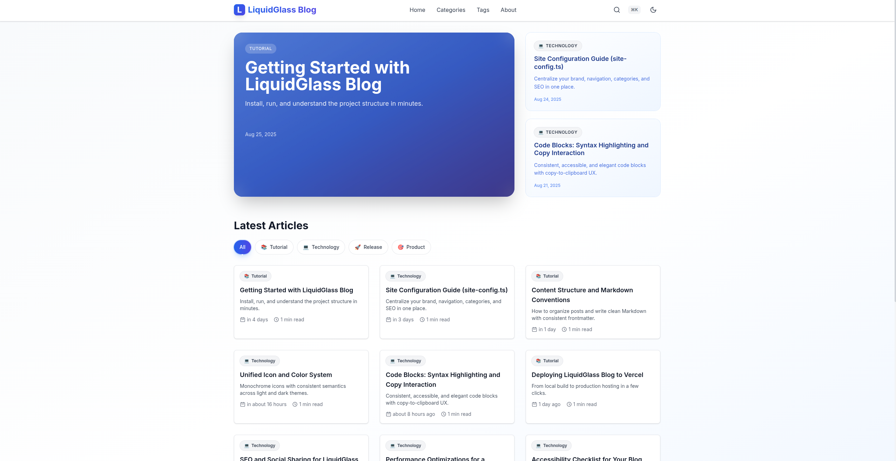
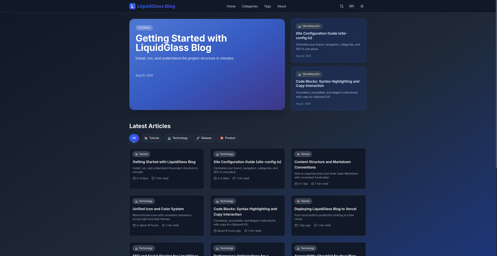
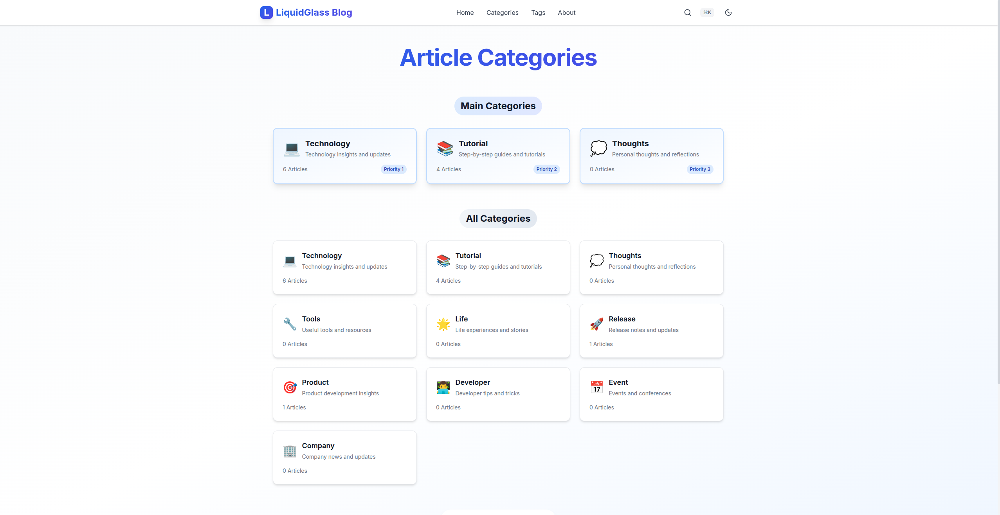
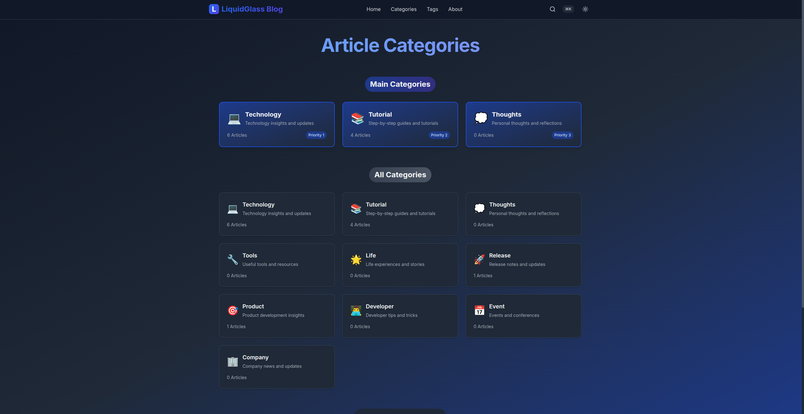
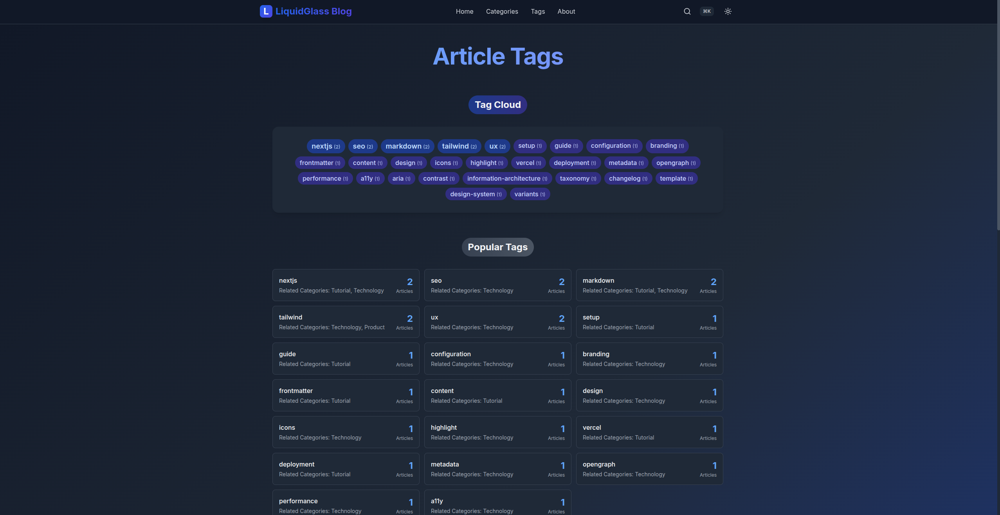
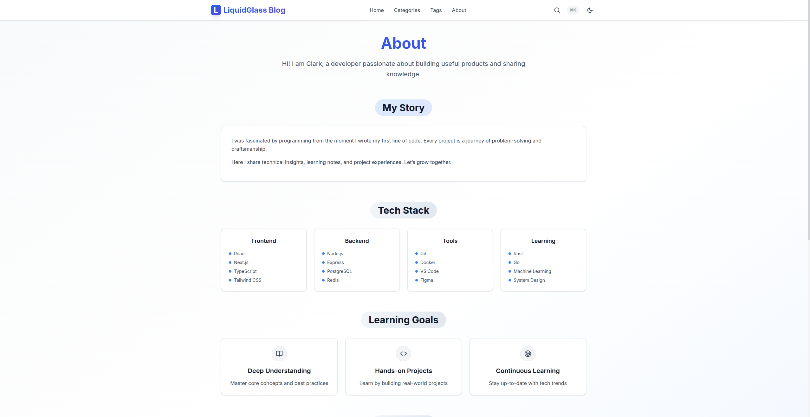
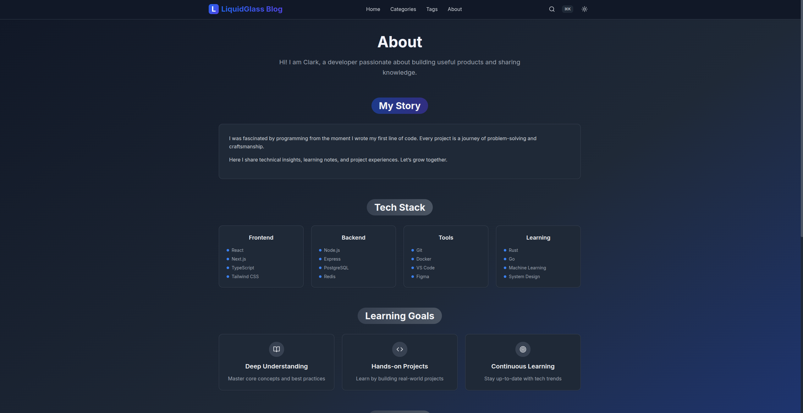
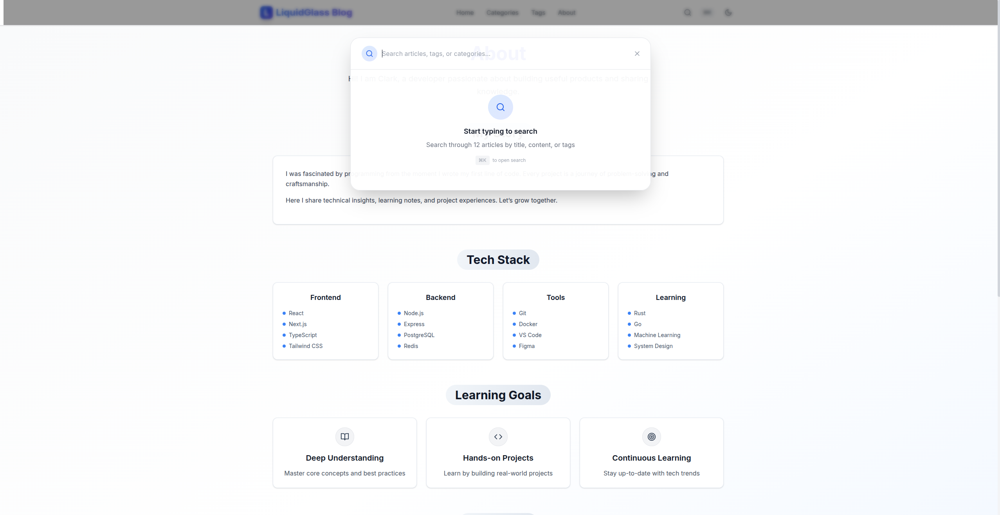
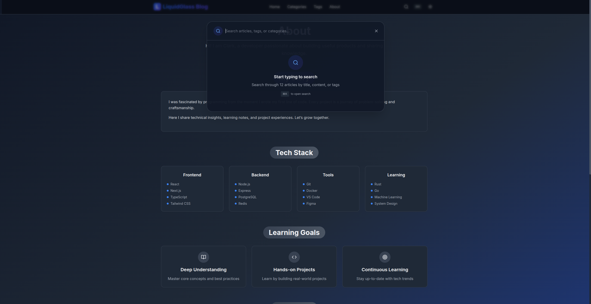

# LiquidGlass Blog

A minimal and elegant blog template for Next.js 14 + TypeScript + Tailwind CSS.

- Demo: https://liquid-glass-blog.vercel.app/
- Template: Click “Use this template” on GitHub to bootstrap your own blog

[](https://vercel.com/new/clone?repository-url=https%3A%2F%2Fgithub.com%2Fclark-ioe%2Fliquid-glass-blog&project-name=liquid-glass-blog&repository-name=liquid-glass-blog&demo-url=https%3A%2F%2Fliquid-glass-blog.vercel.app%2F&env=NEXT_PUBLIC_SITE_URL&envDescription=Public%20site%20URL%20used%20by%20sitemap%20and%20metadata&envLink=https%3A%2F%2Fgithub.com%2Fclark-ioe%2Fliquid-glass-blog%23customize)

## Screenshots












## Features

- Clean and responsive UI with dark mode
- Markdown posts with syntax highlighting and copy-to-clipboard
- Centralized config in `src/lib/site-config.ts`
- Categories/Tags pages, client-side pagination
- SEO-ready with Open Graph and Twitter meta

## Quick Start

```bash
pnpm install
pnpm dev
```

Open http://localhost:3000

## Customize

- Edit site settings in `src/lib/site-config.ts`
- Add posts under `content/posts/*.md`
- Update colors and theme in `tailwind.config.js`

## Build & Deploy

```bash
pnpm build && pnpm start
```

Deploy to Vercel or your favorite platform.

## License

MIT
